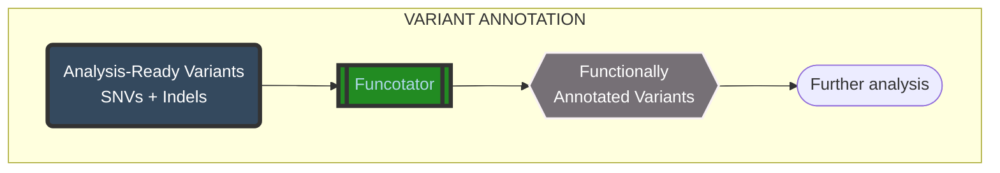

# VARIANT ANNOTATION - GATK4 Funcotator

---

## Table of contents

- [VARIANT ANNOTATION - GATK4 Funcotator](#variant-annotation---gatk4-funcotator)
  - [Table of contents](#table-of-contents)
  - [Variant annotation process](#variant-annotation-process)
    - [1. Functional annotation workflow](#1-functional-annotation-workflow)
    - [2. Germline pre-packaged data sources](#2-germline-pre-packaged-data-sources)
    - [3. GATK4 Funcotator](#3-gatk4-funcotator)
    - [4. Extract fields from VCF file to a tab-delimited table](#4-extract-fields-from-vcf-file-to-a-tab-delimited-table)

## Variant annotation process

### 1. Functional annotation workflow



### 2. Germline pre-packaged data sources

```bash
./gatk FuncotatorDataSourceDownloader --germline --validate-integrity --extract-after-download
```

### 3. GATK4 Funcotator

```bash
# Set up relevant absolute path
variant="path/to/variant_calling"
reference="path/to/reference/UCSC_hg38/chr21.fa.gz"
dataSources="path/to/reference/funcotator_dataSources.v1.7.20200521g/"
annotation="path/to/annotation"
results="path/to/results"
```

```bash
gatk --java-options "-Xmx4G" Funcotator \
    -V "${variant}/chr21_tumor_cnn_filtered.vcf" \
    -R "${reference}" \
    -O "${annotation}/chr21_tumor_funcotated.vcf" \
    --output-file-format VCF \
    --data-sources-path ${dataSources} \
    --ref-version hg38
```

### 4. Extract fields from VCF file to a tab-delimited table

```bash
gatk VariantsToTable \
    -V "${annotation}/chr21_tumor_funcotated.vcf" -F AC -F AN -F DP -F AF -F FUNCOTATION \
    -O "${results}/chr21_tumor_output.table"
```
