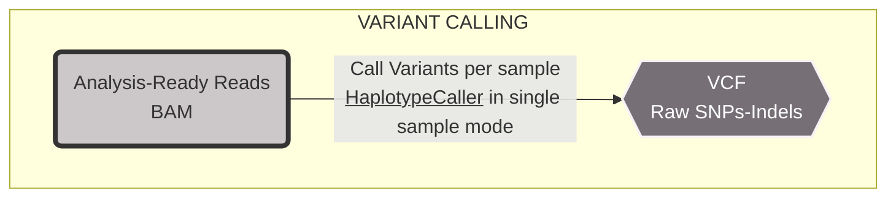
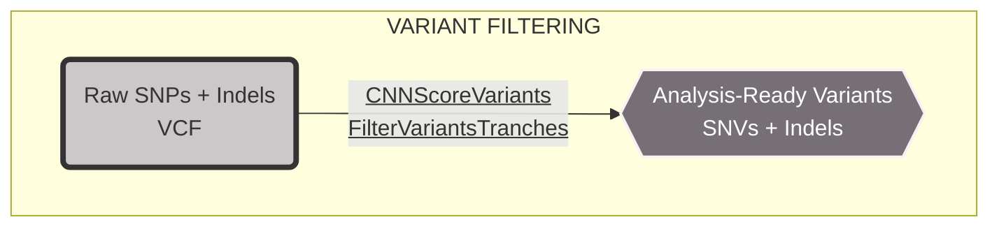
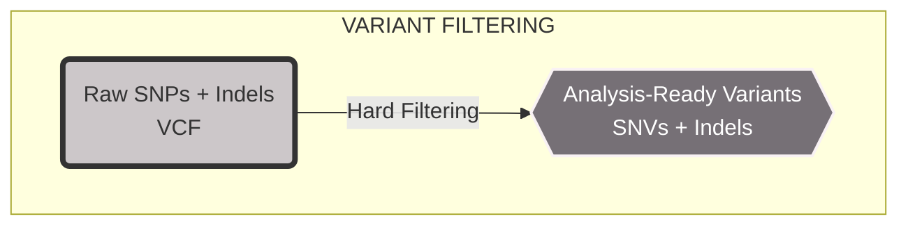

# VARIANT PROCESSING

## VARIANT CALLING

### 1. Workflow of variant calling using HaplotypeCaller



#### Setup directories path

```bash
# Set up your own path to both fasta reference, recalibrated bam file and output variant calling folder
reference="${known_snps}/chr21.fa.gz"
recal_reads="${known_snps}/chr21_tumor_recal.bam"
output_vcf="${known_snps}/variant_calling"
known_snps="${known_snps}/known_snps"
known_indels="${known_snps}/known_indels"
```

### 2. FASTA - Reference genome format

<https://gatk.broadinstitute.org/hc/en-us/articles/360035531652-FASTA-Reference-genome-format>

1. Create the FASTA index file (only bgzip can be indexed)

    ```bash
    reference="${known_snps}/chr21.fa.gz"

    gzip -d ${reference}
    bgzip ${reference%.*} 
    samtools faidx $reference
    ```

2. Create the FASTA sequence dictionary file

    ```bash
    reference="${known_snps}/chr21.fa.gz"
    gatk CreateSequenceDictionary -R ${reference}
    ```

3. Testing GATK with CountReads to count the number of sequence reads in a BAM file

    ```bash
    gatk --java-options "-Xmx4G" CountReads \
        -R ${reference} \
        -I ${recal_reads} \
        --QUIET
    ```

### 3. HaplotypeCaller

```bash
output_vcf="${known_snps}/variant_calling"

gatk --java-options "-Xmx4G" HaplotypeCaller \
    -R ${reference} \
    -I ${recal_reads} \
    -O "${output_vcf}/chr21_tumor_raw_variants.vcf" \
    -stand-call-conf 30
```

## VARIANT FILTERING (QUALITY-BASED FILTERING)



### 1. CNNScoreVariants

```bash
gatk --java-options "-Xmx4G" CNNScoreVariants \
    -R ${reference} \
    -V "${output_vcf}/chr21_tumor_raw_variants.vcf" \
    -O "${output_vcf}/chr21_tumor_cnn.vcf"
```

### 2. FilterVariantTranches

```bash
gatk --java-options "-Xmx4G" FilterVariantTranches \
    -V "${output_vcf}/chr21_tumor_cnn.vcf" \
    --resource "${known_snps}/dbsnp_146.hg38.vcf.gz" \
    --resource "${known_snps}/1000G_omni2.5.hg38.vcf.gz" \
    --resource "${known_snps}/1000G_phase1.snps.high_confidence.hg38.vcf.gz" \
    --resource "${known_indels}/Mills_and_1000G_gold_standard.indels.hg38.vcf.gz" \
    --resource "${known_indels}/known_indels/Homo_sapiens_assembly38.known_indels.vcf.gz" \
    -O "${output_vcf}/chr21_tumor_filtered.vcf" \
    --snp-tranche 99.95 \
    --indel-tranche 99.4 \
    --info-key CNN_1D
```

#### Variant Genotype Filters

- Remove genotype DP < 30
- Removal of sites with low genotype quality score: GQ < 20

```bash
bcftools filter -i ' FORMAT/GQ>=20 & FORMAT/DP>=30' ${output_vcf}/chr21_tumor_filtered.vcf > ${output_vcf}/chr21_tumor_filteredGT.vcf
```



### 3. Hard Filtering option

- #### Extract SNPs and INDELS

```bash
gatk SelectVariants -R ${reference} -V "${output_vcf}/chr21_tumor_raw_variants.vcf" --select-type SNP -O ${output_vcf}/chr21_tumor_raw_snps.vcf

gatk SelectVariants -R ${reference} -V "${output_vcf}/chr21_tumor_raw_variants.vcf" --select-type INDEL -O ${output_vcf}/chr21_tumor_raw_indels.vcf
```

- #### Filter SNPs

```bash
gatk VariantFiltration \
    -R ${reference} \
    -V "${output_vcf}/chr21_tumor_raw_variants.vcf" \
    -O "${output_vcf}/chr21_tumor_filtered_snps.vcf" \
    -filter-name "QD_filter" -filter "QD < 2.0" \
    -filter-name "FS_filter" -filter "FS > 60.0" \
    -filter-name "MQ_filter" -filter "MQ < 40.0" \
    -filter-name "SOR_filter" -filter "SOR > 3.0" \
    -filter-name "MQRankSum_filter" -filter "MQRankSum < -12.5" \
    -filter-name "ReadPosRankSum_filter" -filter "ReadPosRankSum < -8.0" \
    -genotype-filter-expression "DP < 30" \
    -genotype-filter-name "DP_filter" \
    -genotype-filter-expression "GQ < 20" \
    -genotype-filter-name "GQ_filter"
```

- #### Filter INDELs

```bash
gatk VariantFiltration \
    -R ${reference} \
    -V "${output_vcf}/chr21_tumor_raw_variants.vcf" \
    -O "${output_vcf}/chr21_tumor_filtered_indels.vcf" \
    -filter-name "QD_filter" -filter "QD < 2.0" \
    -filter-name "FS_filter" -filter "FS > 200.0" \
    -filter-name "SOR_filter" -filter "SOR > 10.0" \
    -filter-name "ReadPosRankSum_filter" -filter "ReadPosRankSum < -20.0" \
    -genotype-filter-expression "DP < 30" \
    -genotype-filter-name "DP_filter" \
    -genotype-filter-expression "GQ < 20" \
    -genotype-filter-name "GQ_filter"
```

- #### Select Variants that "PASS" filters

```bash
gatk SelectVariants \
    --exclude-filtered \
    -V "${output_vcf}/chr21_tumor_filtered_snps.vcf" \
    -O ${output_vcf}/chr21_tumor_ready_snps.vcf
```

```bash
gatk SelectVariants \
    --exclude-filtered \
    -V "${output_vcf}/chr21_tumor_filtered_indels.vcf" \
    -O ${output_vcf}/chr21_tumor_ready_indels.vcf
```

- #### Exclude variants that failed genotype filters

```bash
cat "${output_vcf}/chr21_tumor_ready_snps.vcf" | grep -v -E "DP_filter|GQ_filter" > chr21_tumor_ready_snpsGT.vcf

cat "${output_vcf}/chr21_tumor_ready_indels.vcf" | grep -v -E "DP_filter|GQ_filter" > chr21_tumor_ready_indelsGT.vcf
```
